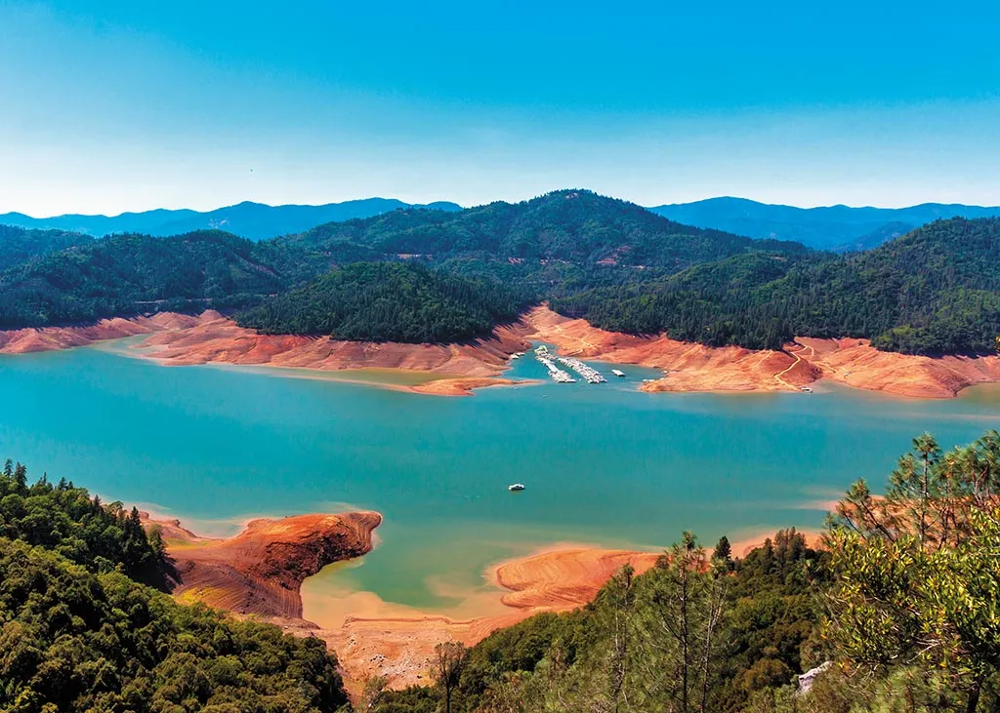

# Homework 3: Applications of Machine Learning – Land Cover Classification for Lake Shasta

This project analyzed long-term changes in the surface area of Shasta Lake using Landsat satellite imagery and machine learning techniques. As California’s largest reservoir, Shasta Lake plays a critical role in water storage, agriculture, and energy production, yet it has experienced substantial fluctuations due to drought and changing climate conditions. To quantify these changes, Landsat images from 1985 to 2025 were processed and classified using a Random Forest model trained on spectral features such as NDWI and reflectance bands. The model was applied to generate water masks and estimate lake area over time, producing a multi-decadal time series. Results show a general decline in lake area, with notable reductions during known drought periods, consistent with historical observations of decreased water levels and capacity. 
